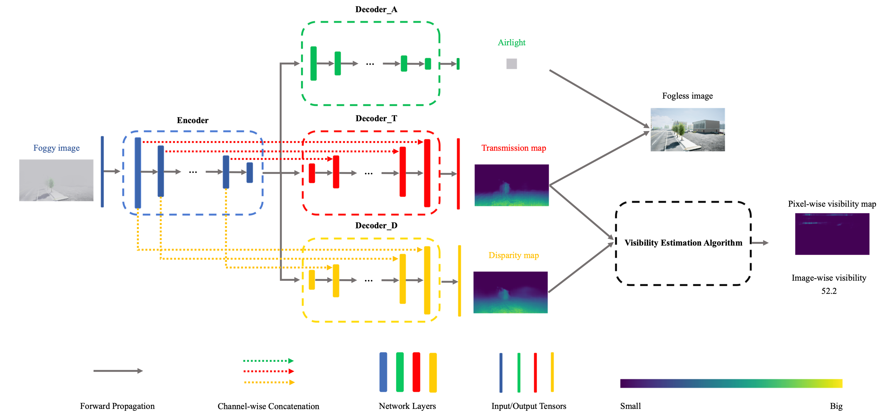

# DMRVisNet

PyTorch implementation and pretrained model for DMRVisNet. For details, see the paper [DMRVisNet: Deep Multihead Regression Network for Pixel-Wise Visibility Estimation Under Foggy Weather](https://ieeexplore.ieee.org/document/9794328).
<div align="center">
  
</div>

## Preparation

### Environment

Please make sure that you have installed torch, einops, tqdm, Pillow, opencv-python, progress and matplotlib.

### Download Dataset

Please refer to [FACI](https://github.com/coutyou/FoggyAirsimCityImages/tree/main) dataset.

### Download pre-trained model weight

Please download from [Google Drive](https://drive.google.com/drive/folders/1DlrT_F8tiiv2r4f32L6dB0FM8hxskQq-?usp=sharing).

### File Structure

```
dmrvisnet
├── checkpoints
│   └── final
├── data_pkl
│   ├── 000_000.pkl
│   ├── 000_001.pkl
│   ├── ...
│   ├── 099_028.pkl
│   └── 099_029.pkl
├── src
├── train.sh
└── test.sh
```

## Train

```bash
./train.sh
```

## Test

```bash
./test.sh
```

## Quick start

Please refer to src/quickstart.ipynb

## Citation

Please cite this as:

```
@article{you2022dmrvisnet,
  title={Dmrvisnet: Deep multihead regression network for pixel-wise visibility estimation under foggy weather},
  author={You, Jing and Jia, Shaocheng and Pei, Xin and Yao, Danya},
  journal={IEEE Transactions on Intelligent Transportation Systems},
  volume={23},
  number={11},
  pages={22354--22366},
  year={2022},
  publisher={IEEE}
}
```
